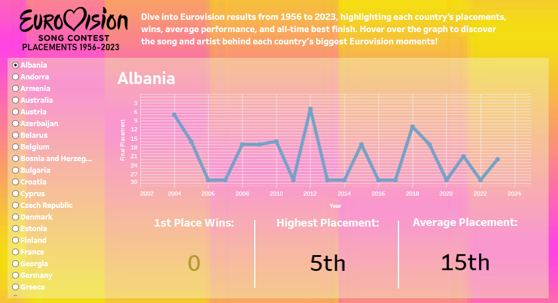

# Eurovision Song Contest Dashboard (1956–2023)

This repository contains an interactive Tableau dashboard visualizing the history of the Eurovision Song Contest from its debut in 1956 to 2023. The dashboard allows users to explore each country's performance over time and learn more about their history in the Eurovision Song Contest.

## Features
- **Country Placements (1956–2023):** Track yearly performance for every participating country.  
- **Total Wins:** See how many times each country has taken 1st place.  
- **Average Placement:** View each country's overall performance trends.  
- **All-Time Best Finish:** Discover their highest-ever ranking.  
- **Interactive Details:** Hover over the graph to reveal the song and artist for each country's yearly entry.

## Files
- `Eurovision_Country_Placements_1956_to_2023_Dashboard.twbx` – The packaged Tableau workbook file containing the dashboard.  
- `Eurovision_Song_Contest_Dashboard.PNG` – A static preview image of the dashboard.

## Usage
1. Download the `.twbx` file and open it in [Tableau Desktop](https://www.tableau.com/products/desktop) or visit the published dashboard on Tableau Public - [Eurovision Song Contest Placements 1956-2023](https://public.tableau.com/views/Eurovision-CountryPlacements1956to2023/Dashboard1?:language=en-US&publish=yes&:sid=&:redirect=auth&:display_count=n&:origin=viz_share_link).  
2. Interact with the filters to view specific countries, placements, and performance trends.  
3. Use hover interactions on the line graph to see song and artist details.
